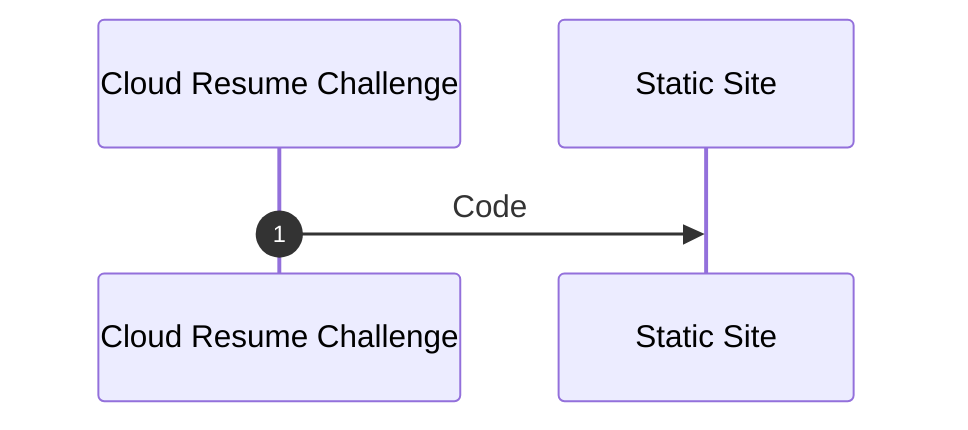

---
# Cloud Resume Challenge for AWS
[Original Challenge Link](https://cloudresumechallenge.dev/docs/the-challenge/aws/){ .md-button }

[My Completed Project](https://ospf2fullstack.github.io/garyinnerarity/){ .md-button }

# Certification 
## Pre-req
:heavy_check_mark: [Certification](https://github.com/ospf2fullstack/docs/blob/main/docs/assets/img/AWS_CloudPract.png?raw=true)
Your resume needs to have the AWS Cloud Practitioner certification on it. This is an introductory certification that orients you on the industry-leading AWS cloud.

{ loading=lazy }

# The HTML
:heavy_check_mark: HTML
Your resume needs to be written in HTML. Not a Word doc, not a PDF. Here is an example of what I mean.

## HTML Code
```html
<html>
    <body>
        <h1>My Name, </h1>
        <p>Some beautiful information about me. </p>
    </body>
</html>
```

# The CSS
:heavy_check_mark: CSS
Your resume needs to be styled with CSS. No worries if you’re not a designer – neither am I. It doesn’t have to be fancy. But we need to see something other than raw HTML when we open the webpage.

## CSS Code
```css
body {
  font-family: "Georgia";
  background: #2980b9;
  overflow: hidden;
  height: 100%;
  width: 100%;
}

h1 {
  color: white;
  font-size: 2em;
  font-weight: 100;
  letter-spacing: 0.2em;
  position: absolute;
  top: 40%;
  left: 50%;
  transform: translate3d(-50%, -50%, 0);
}

p {
  color: white;
  font-size: 1em;
  font-weight: 100;
  letter-spacing: 0.2em;
  position: absolute;
  top: 55%;
  left: 50%;
  transform: translate3d(-50%, -50%, 0);
}
```
# Static Website
:heavy_check_mark: Static Website
Your HTML resume should be deployed online as an Amazon S3 static website. Services like Netlify and GitHub Pages are great and I would normally recommend them for personal static site deployments, but they make things a little too abstract for our purposes here. Use S3.


> Make it harder! Deploy s3 with terraform :smile:

## Terraform 

``` yaml
# create le bucket
resource "aws_s3_bucket" "awscloudresumechallenge" {
  bucket = "awscloudresumechallenge.garyinnerarity.com"
}

# create static website configuration (attahc to bucket)
resource "aws_s3_bucket_website_configuration" "awscloudresumechallengeconfig" {
  bucket = var.awscloudresumechallenge
  
  index_document {
    suffix = "index.html"
  }

}

# attach policy to s3 bucket that is le static website 
resource "aws_s3_bucket_public_access_block" "innerarity-allow-public" {
  bucket = var.awscloudresumechallenge

  block_public_acls = false
  block_public_policy = false
  ignore_public_acls = false
  restrict_public_buckets = false
}
```
## Pipelines (the dirty type :smile: )
``` yaml
name: SyncHub2S3

on:
  push:
    branches: [ main ]
  workflow_dispatch:
# A workflow run is made up of one or more jobs that can run sequentially or in parallel
jobs:
  # This workflow contains a single job called "build"
  build:
    # The type of runner that the job will run on
    runs-on: ubuntu-latest
    # https://github.com/marketplace/actions/s3-sync 
    steps:
      - uses: actions/checkout@master
      - uses: jakejarvis/s3-sync-action@master
        with:
          args: --acl public-read --follow-symlinks --delete --exclude '.git/*' --exclude '.github/*'
        env:
          AWS_S3_BUCKET: ${{ secrets.AWS_S3_BUCKET }}
          AWS_ACCESS_KEY_ID: ${{ secrets.AWS_ACCESS_KEY_ID }}
          AWS_SECRET_ACCESS_KEY: ${{ secrets.AWS_SECRET_ACCESS_KEY }}
          AWS_REGION: ${{ secrets.AWS_REGION }}
          SOURCE_DIR: '.'
```

If you have the AWS account, use the `a` record to create an alias to the s3 service. 

# HTTPS
:heavy_check_mark: HTTPS
The S3 website URL should use HTTPS for security. You will need to use Amazon CloudFront to help with this.

`AWS Certificate Manager is your friend.`

# CNAME
:heavy_check_mark: DNS
Point a custom DNS domain name to the CloudFront distribution, so your resume can be accessed at something like my-c00l-resume-website.com. You can use Amazon Route 53 or any other DNS provider for this. A domain name usually costs about ten bucks to register.

This part is VERY easy if you have AWS Route53 as your DNS provider and registrar - which I do, but I also use CloudFlare to make my life a pain in the ass... So, at the moment, I'm using CloudFlare as my registrar. 

So, point the sub-domain to the s3 bucket address with a CNAME record: 
``` shell
CNAME awscloudresumechallenge -> awscloudresumechallenge.garyinnerarity.com.s3-website-us-east-1.amazonaws.com 
```
# JavaScript
:heavy_check_mark: Javascript
Your resume webpage should include a visitor counter that displays how many people have accessed the site. You will need to write a bit of Javascript to make this happen. Here is a helpful tutorial to get you started in the right direction.

```js
// the basics - below in the api section i'll included updated code
    var counterContainer = document.querySelector(".visitorcounter");
    var visitCount = localStorage.getItem("page_view");
    visitCount = 100013;

    //add entry for key="page_view"
    localStorage.setItem("page_view", 1);
    
    visitCount = Number(visitCount) + 1;

    //update local storage value
    localStorage.setItem("page_view", visitCount);

    counterContainer.innerHTML = visitCount;
```

# Database (dynamodb)
:heavy_check_mark: Database
The visitor counter will need to retrieve and update its count in a database somewhere. I suggest you use Amazon’s DynamoDB for this. (Use on-demand pricing for the database and you’ll pay essentially nothing, unless you store or retrieve much more data than this project requires.) Here is a great free course on DynamoDB.

```js
// dynamodb configuration
{
  "VisitorID": {
    "S": ""
  },
  "CreationDate": {
    "S": ""
  }
}
```

# API
:heavy_check_mark: API
Do not communicate directly with DynamoDB from your Javascript code. Instead, you will need to create an API that accepts requests from your web app and communicates with the database. I suggest using AWS’s API Gateway and Lambda services for this. They will be free or close to free for what we are doing.

>[Look, I followed this okay.](https://aws.amazon.com/blogs/compute/using-amazon-api-gateway-as-a-proxy-for-dynamodb/), don't forget to create your IAM role before making your REST API. 

[ ] Python
You will need to write a bit of code in the Lambda function; you could use more Javascript, but it would be better for our purposes to explore Python – a common language used in back-end programs and scripts – and its boto3 library for AWS. Here is a good, free Python tutorial.

[ ] Tests
You should also include some tests for your Python code. Here are some resources on writing good Python tests.

[ ] Infrastructure as Code
You should not be configuring your API resources – the DynamoDB table, the API Gateway, the Lambda function – manually, by clicking around in the AWS console. Instead, define them in an AWS Serverless Application Model (SAM) template and deploy them using the AWS SAM CLI. This is called “infrastructure as code” or IaC. It saves you time in the long run.

Note: A more broadly applicable and commonly-used IaC tool in the industry is Terraform. It’s a little less straightforward to use than SAM for an AWS serverless API, but many people prefer to use it for their project anyway. If you want to use Terraform instead of SAM, follow this guide.

[ ] Source Control
You do not want to be updating either your back-end API or your front-end website by making calls from your laptop, though. You want them to update automatically whenever you make a change to the code. (This is called continuous integration and deployment, or CI/CD.) Create a GitHub repository for your backend code.

[ ] CI/CD (Back end)
Set up GitHub Actions such that when you push an update to your Serverless Application Model template or Python code, your Python tests get run. If the tests pass, the SAM application should get packaged and deployed to AWS.

[ ] CI/CD (Front end)
Create a second GitHub repository for your website code. Create GitHub Actions such that when you push new website code, the S3 bucket automatically gets updated. (You may need to invalidate your CloudFront cache in the code as well.) Important note: DO NOT commit AWS credentials to source control! Bad hats will find them and use them against you!

[ ] Blog post
Finally, in the text of your resume, you should link a short blog post describing some things you learned while working on this project. Dev.to or Hashnode are great places to publish if you don’t have your own blog.

And that’s the gist of it! For strategies, tools, and further challenges to help you get hired in cloud, check out the AWS edition of the Cloud Resume Challenge book.